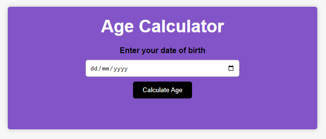
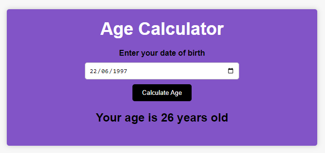
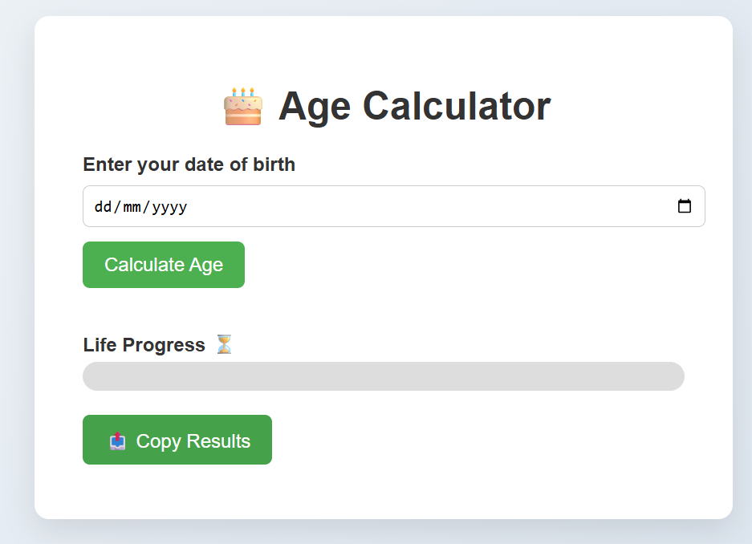
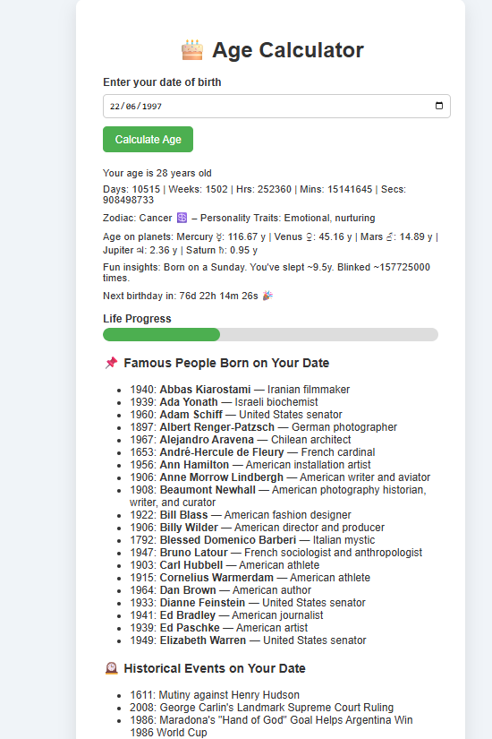

# Age-Calculator

## 📌 Description
The Age Calculator is a dynamic and interactive web application that allows users to determine their age in real-time. Enter your birthdate, and the app calculates your age in years, months, days, hours, minutes, and seconds. It also provides zodiac insights, planetary age, next birthday countdown, life progress, fun statistics, and historical context using live API data.

Built with HTML, CSS, and JavaScript, this project is fully responsive and optimized for both desktop and mobile devices.

## 🛠 Prerequisites
* A modern web browser (Chrome, Firefox, Edge, Safari)
* Internet connection (required for fetching live API data)

## 📋 Features
* Real-time age calculation with breakdown: years, months, days, hours, minutes, seconds.
* Zodiac sign with personality traits.
* Age on other planets (Mercury, Venus, Mars, Jupiter, Saturn).
* Next birthday countdown.
* Fun insights: day of the week born, approximate sleep years, estimated number of blinks.
* Life progress dashboard based on an 80-year lifespan.
* Live fetching of famous birthdays for the selected date.
* Copy results to clipboard for sharing.
* Fully responsive and mobile-friendly interface.

## 💻 Technologies Used
This project was built using:
* HTML
* CSS
* JavaScript
* REST API integration (https://api.dayinhistory.dev)

## 🚀 Installation
No installation is required. Simply open the application in your web browser.

## 📚 Usage
1. Open the Age Calculator web application.
2. Enter your birthdate in the provided input field.
3. Click the "Calculate Age" button.
4. View your detailed age information:
*  Age in years, months, days, hours, minutes, seconds.
*  Zodiac sign and personality traits.
*  Age on other planets.
*  Fun insights and life progress bar.
*  Countdown to your next birthday.
*  Famous birthdays on your birth date.
5. Use the 📤 Copy Results button to share your information.

## 🔗 Live Demo & Repository
Application can be viewed here: 
* [Live](https://yvonnesarah.github.io/Age-Calculator/)

* [Repository](https://github.com/yvonnesarah/Age-Calculator)

## 🖼 Screenshot(S)
Before Design

Age Calculator Interface

Example Calculation

After Design

Age Calculator Interface

Example Age Calculator

## 🚀 Future Improvements
* 📱 Enhanced Mobile Experience – Improve layout and interactions on smaller screens. ✅
* 📊 Detailed Age Breakdown – Show additional info like total days lived, weeks, or hours. ✅

## 🆕 Upcoming Enhancements
* 🎯 Live Age Counter – Continuously updates your age every second, including years, days, hours, minutes, and seconds. ✅
* 📅 Next Birthday Countdown – Shows a real-time countdown to your next birthday (days, hours, minutes, seconds). ✅
* 🎉 Zodiac Sign + Fun Facts – Automatically detects your zodiac sign and displays personality traits.✅
* 🌍 Age on Other Planets – Calculates age on Mercury, Venus, Mars, Jupiter, and Saturn based on orbital periods.✅
* 📈 Life Stats Dashboard – Visual progress bar showing your progress toward estimated lifespan.✅
* 🧠 Smart Insights – Fun facts including: Day of the week you were born, Estimated years spent sleeping 😴, Approximate number of blinks 👀 ✅
* 📤 Share Feature – Copy all results to clipboard for easy sharing. ✅
* 🧪 API Integration – Fetches famous birthdays on your selected date. ✅

## 👥 Credit
Designed and developed by Yvonne Adedeji.

## 📜 License
This project is open-source. For licensing details, please refer to the LICENSE file in the repository.

## 📬 Contact
You can reach me at 📧 yvonneadedeji.sarah@gmail.com.
